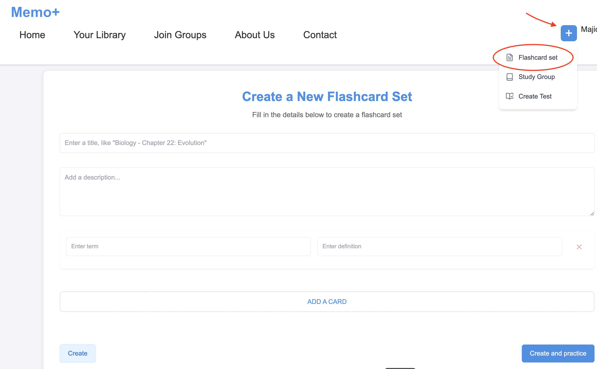
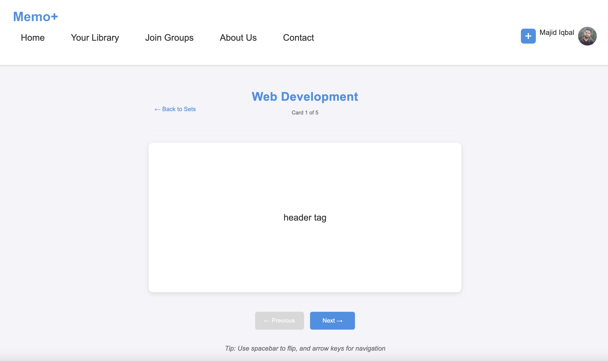
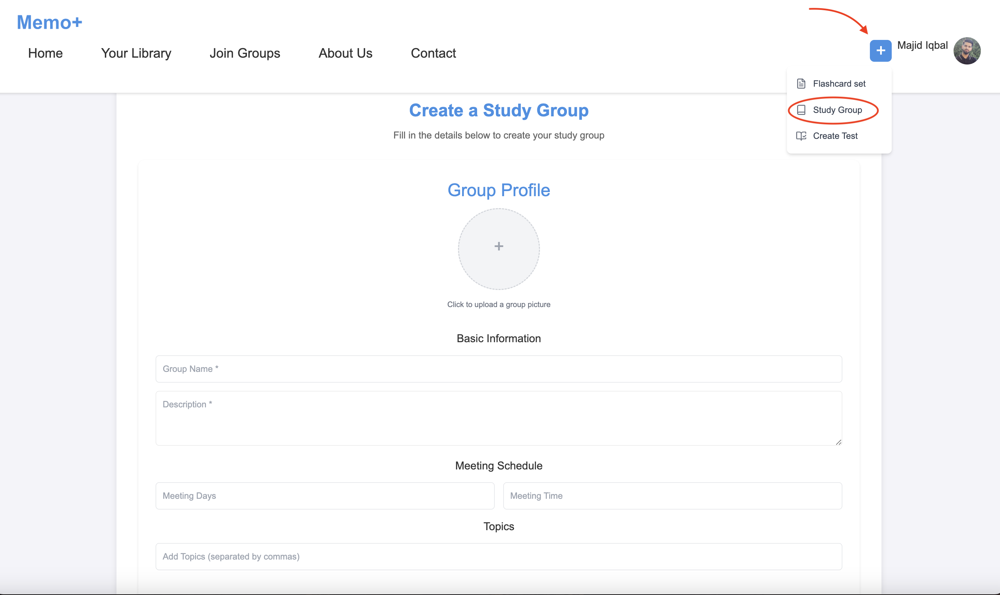
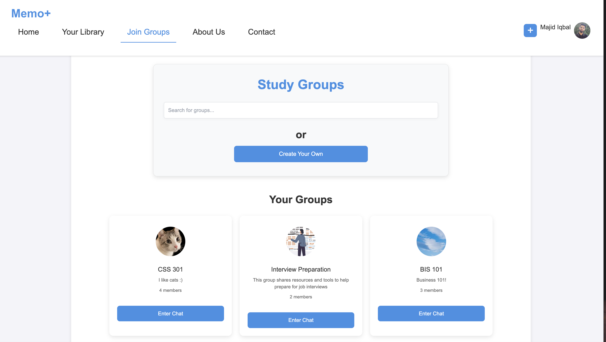
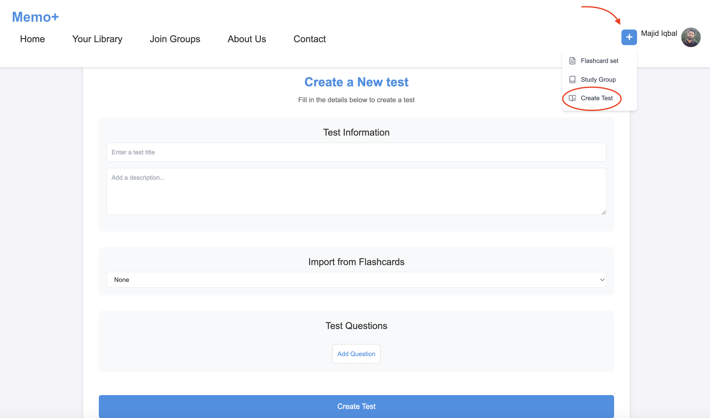
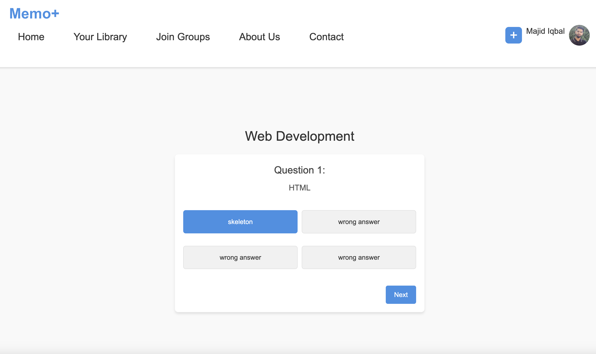
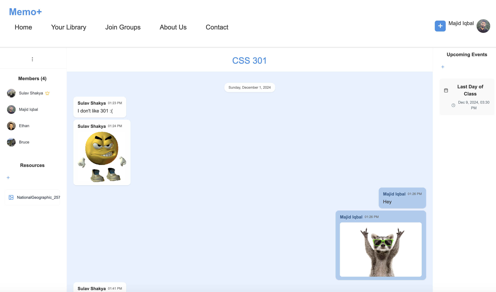

# Memo+ Study Group Application

A collaborative learning platform that allows users to create and join study groups, make flashcards, take tests, and communicate in real-time.

## Prerequisites

Before you begin, ensure you have installed:
- Node.js (v16.0.0 or higher)
- npm (v8.0.0 or higher)
- Git

## Installation

1. Clone the repository:
```bash
git clone https://github.com/majid-iqbal1/firebase-project.git
cd firebase-project
```

2. Install dependencies:
```bash
npm install
```

3. Create a `.env` file in the root directory and add your Firebase and EmailJS configuration:
```env
REACT_APP_apiKey=your_firebase_api_key
REACT_APP_authDomain=your_firebase_domain
REACT_APP_projectId=your_project_id
REACT_APP_storageBucket=your_storage_bucket
REACT_APP_messagingSenderId=your_messaging_id
REACT_APP_appId=your_app_id

REACT_APP_EMAILJS_SERVICE_ID=your_emailjs_service_id
REACT_APP_EMAILJS_TEMPLATE_ID=your_emailjs_template_id
REACT_APP_EMAILJS_PUBLIC_KEY=your_emailjs_public_key
```

4. Start the development server:
```bash
npm start
```

## Dependencies

Core Dependencies:
- React (v18.3.1)
- React Router DOM (v6.28.0)
- Firebase (v11.0.1)
- EmailJS Browser (v4.4.1)
- Lucide React (v0.456.0)

Development Dependencies:
- Autoprefixer (v10.4.20)
- PostCSS (v8.4.47)

## Features and Usage Guide

### Authentication
1. **Sign Up**
   - Click "Sign Up" on the landing page
   - Enter your name, email, and password
   - Or use Google Sign-in

   

2. **Sign In**
   - Enter your email and password
   - Or use Google Sign-in

   

### Flashcards
1. **Create Flashcard Set**
   - Click "+" button > "Flashcard set"
   - Enter title and description
   - Add terms and definitions
   - Click "Create" or "Create and practice"
   
   

2. **Study Flashcards**
   - Navigate to "Your Library"
   - Select a flashcard set
   - Click "Study" to begin
   
   

### Study Groups
1. **Create Group**
   - Click "+" > "Study Group"
   - Fill in group details
   - Add group image (optional)
   - Set privacy settings
   
   

2. **Join Group**
   - Go to "Join Groups"
   - Search for groups
   - Click "Join" on desired group
   - Your groups will appear at the top
   
   

### Tests
1. **Create Test**
   - Click "+" > "Test"
   - Add questions and answers
   - Import from flashcards (optional)
   
   

2. **Take Test**
   - Select test from Tests page
   - Answer questions
   - View results
   
   

### Group Chat
- Access group chat from group page
- Share resources and files
- Schedule events




## License

Copyright (c) 2024 Memo+. All Rights Reserved.

This project and its contents are protected under copyright law. No part of this project may be reproduced, distributed, or transmitted in any form or by any means without the prior written permission of the copyright holders.

## Authors
- Majid Iqbal
- Sulav Shakya
- Bruce Duong
- Ethan Humrich

## Acknowledgments
- UW Bothell CSS 481 Course